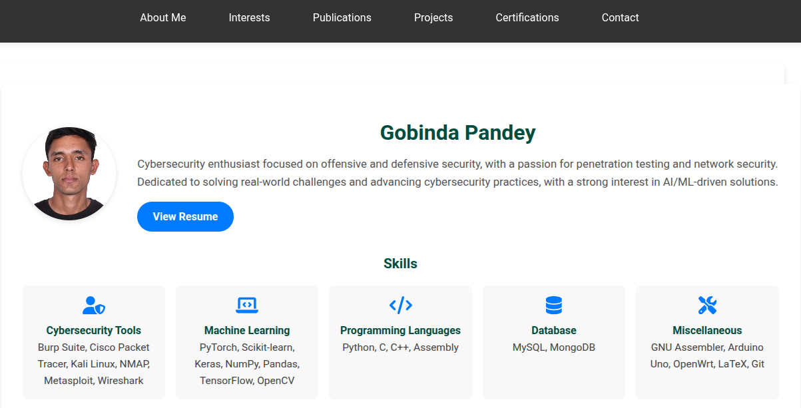

# 🌟 Gobinda Pandey - Portfolio Website# 🌟 


A modern, secure, and responsive portfolio website showcasing professional experience, projects, publications, certifications, and research interests in cybersecurity and information assurance.


A modern, responsive portfolio website showcasing my professional experience, projects, publications, certifications, and research interests in cybersecurity and information assurance.This is a professional academic portfolio for Gobinda Pandey, a master's student in Information Assurance at St. Cloud State University. It showcases Gobinda's research interests, publications, certifications, and projects.

## Getting Started

## 📋 Table of Contents[](https://reactjs.org/)

- [Features](#-features)[](https://nodejs.org/)### Prerequisites

- [Tech Stack](#️-tech-stack)

- [Project Structure](#-project-structure)[](LICENSE)

- [Quick Start](#-quick-start)

- [Security](#-security)- Node.js

- [Deployment](#-deployment)

- [Customization](#-customization)- npm

- [Author](#-author)


---

## ✨ Features### Installation

## ✨ Features


### Design & UX

- **🎨 Modern UI/UX** - Clean, professional design with smooth animations- **🎨 Modern UI/UX**: Clean, professional design with smooth animations and transitions1. Clone the repository:

- **📱 Fully Responsive** - Seamless experience across all devices

- **🍔 Mobile Navigation** - Hamburger menu with smooth slide-in animation- **📱 Fully Responsive**: Seamless experience across desktop, tablet, and mobile devices   ```sh

- **💼 Professional Branding** - Custom logo with gradient effects

- **🎯 Section Navigation** - Smooth scrolling with active section highlighting- **🍔 Mobile Navigation**: Hamburger menu with smooth slide-in animation   git clone https://github.com/Adnibog/gp.git


### Functionality- **💼 Professional Branding**: Custom logo with gradient effects   ```

- **📧 Secure Contact Form** - Backend-powered with email notifications

- **🔔 Auto-Reply** - Automated confirmation sent to visitors- **📧 Contact Form**: Backend-powered contact form with email notifications2. Navigate to the project directory:

- **📄 Downloadable CV** - Easy access to professional resume

- **🔗 Social Integration** - Direct links to LinkedIn, GitHub, and profiles- **🔔 Auto-Reply**: Automated email confirmation sent to visitors   ```sh


### Security- **⚡ Rate Limiting**: Protection against spam submissions   cd portfolio

- **🔐 API Key Authentication** - Only authorized requests processed

- **🛡️ Origin Verification** - Blocks unauthorized domains- **🎯 Section Navigation**: Smooth scrolling with active section highlighting   ```

- **⚡ Rate Limiting** - 5 submissions per IP per 15 minutes

- **🍯 Honeypot Protection** - Catches automated bots- **📄 Downloadable CV**: Easy access to professional resume3. Install npm packages:

- **🧹 Input Sanitization** - Prevents XSS attacks

- **📊 Request Logging** - Monitor all activity with IP tracking- **🔗 Social Links**: Direct links to LinkedIn, GitHub, and professional profiles   ```sh


### Content Sections- **🎓 Academic Publications**: Showcase of research contributions   npm install

- **👤 Profile** - Professional bio, skills, education, experience

- **💻 Projects** - Visual showcase with detailed descriptions- **🏆 Awards & Certifications**: Display of achievements and credentials   ```

- **📚 Publications** - Academic research contributions

- **🏆 Certifications** - Professional credentials display- **💻 Project Portfolio**: Visual showcase with detailed descriptions

- **🎓 Awards** - Honors and achievements

- **🔬 Research Interests** - Areas of expertise- **🔬 Research Interests**: Comprehensive overview of areas of expertise### Usage


---


## 🛠️ Tech Stack## 🛠️ Tech StackStart the development server:


### Frontend```sh

- **React.js** - Component-based UI library

- **CSS3** - Custom styling with variables and animations### Frontendnpm start

- **FontAwesome** - Icon library

- **React.js** - Component-based UI library```

### Backend

- **Node.js** - JavaScript runtime- **CSS3** - Custom styling with CSS variables and animations

- **Express.js** - Web framework

- **Nodemailer** - Email service- **FontAwesome** - Icon library for visual elements### Building for Production

- **Express Rate Limit** - Request throttling

- **CORS** - Cross-origin protection- **React Hooks** - State and effect management


### DeploymentCreate a production build:

- **GitHub Pages** - Frontend hosting

- **Heroku/Vercel/Railway** - Backend hosting### Backend```sh


---- **Node.js** - JavaScript runtimenpm run build


## 📁 Project Structure- **Express.js** - Web application framework```


```- **Nodemailer** - Email sending functionality

portfolio/

├── public/                    # Static assets- **Express Rate Limit** - Request rate limiting### Deployment

│   ├── index.html            # HTML template

│   ├── pp.jpg                # Profile picture- **CORS** - Cross-origin resource sharing

│   ├── GP_CV.pdf             # Resume/CV

│   └── [images]              # Project/certification images- **Dotenv** - Environment variable managementDeploy the production build to any static site hosting service.

│

├── src/                       # React source files

│   ├── components/

│   │   ├── Navbar.js         # Navigation with hamburger menu### Deployment## Contributing

│   │   ├── Logo.js           # Custom logo component

│   │   ├── Profile.js        # About section- **GitHub Pages** - Frontend hosting

│   │   ├── Projects.js       # Project showcase

│   │   ├── Publications.js   # Academic publications- **Heroku/Vercel/Railway** - Backend hosting options1. Fork the Project

│   │   ├── Certifications.js # Professional certifications

│   │   ├── Awards.js         # Honors and achievements2. Create your Feature Branch

│   │   ├── Interests.js      # Research interests

│   │   ├── Contact.js        # Contact form## 📁 Project Structure3. Commit your Changes

│   │   └── Footer.js         # Footer component

│   ├── App.js                # Main application4. Push to the Branch

│   ├── index.js              # Entry point

│   └── styles.css            # Global styles```5. Open a Pull Request

│

├── server/                    # Backend serverportfolio/

│   ├── server.js             # Express server

│   ├── package.json          # Server dependencies├── public/                 # Static assets## License

│   └── .env.example          # Environment template

││   ├── index.html         # HTML template

├── generate-api-key.sh        # Security key generator

├── setup.sh                   # Automated setup script│   ├── 404.html           # Custom 404 pageDistributed under the MIT License. See `LICENSE` for more information.

└── package.json               # Frontend dependencies

```│   ├── pp.jpg             # Profile picture


---│   ├── GP_CV.pdf          # Resume/CV## Contact


## 🚀 Quick Start│   └── [project images]   # Project screenshots


### Prerequisites├── src/                   # Source filesGobinda Pandey - [gobindapandey223@gmail.com](mailto:gobindapandey223@gmail.com)


- Node.js (v14+)│   ├── components/        # React components

- npm or yarn

- Git│   │   ├── Navbar.js      # Navigation with hamburger menuProject Link: [https://github.com/Adnibog/gp](https://github.com/Adnibog/gp)

- Gmail account

│   │   ├── Logo.js        # Custom logo component

### Installation (5 minutes)│   │   ├── Profile.js     # About section

│   │   ├── Projects.js    # Project showcase

**1. Clone the repository:**│   │   ├── Publications.js # Academic publications

```bash│   │   ├── Certifications.js # Professional certifications

git clone https://github.com/Adnibog/gp.git│   │   ├── Awards.js      # Honors and achievements

cd gp│   │   ├── Interests.js   # Research interests

```│   │   ├── Contact.js     # Contact form with backend integration

│   │   └── Footer.js      # Footer component

**2. Run automated setup:**│   ├── App.js             # Main application component

```bash│   ├── index.js           # Application entry point

./setup.sh│   └── styles.css         # Global styles

```├── server/                # Backend server

│   ├── server.js          # Express server with email handling

Or manually:│   ├── package.json       # Server dependencies

│   └── .env.example       # Environment variables template

```bash├── build/                 # Production build (generated)

# Install frontend dependencies├── package.json           # Frontend dependencies

npm install├── CNAME                  # Custom domain configuration

└── README.md              # This file

# Install backend dependencies```

cd server

npm install## 🚀 Getting Started

cd ..

```### Prerequisites


**3. Generate secure API key:**- Node.js (v14 or higher)

```bash- npm or yarn

./generate-api-key.sh- Git

```- Gmail account (for email notifications)


This creates:### Installation

- `server/.env` with API_SECRET_KEY

- `.env` with REACT_APP_API_KEY1. **Clone the repository**

   ```bash

**4. Configure Gmail:**   git clone https://github.com/Adnibog/portfolio.git

   cd portfolio

- Enable 2-Step Verification: https://myaccount.google.com/security   ```

- Generate App Password: https://myaccount.google.com/apppasswords

- Update `server/.env`:2. **Install frontend dependencies**

   ```bash

```env   npm install

EMAIL_USER=your-email@gmail.com   ```

EMAIL_PASSWORD=your-16-char-app-password

RECIPIENT_EMAIL=your-email@gmail.com3. **Install backend dependencies**

```   ```bash

   cd server

**5. Start development servers:**   npm install

   cd ..

Terminal 1 - Backend:   ```

```bash

cd server4. **Configure environment variables**

npm run dev

```   **IMPORTANT: Generate a secure API key first:**

   ```bash

Terminal 2 - Frontend:   ./generate-api-key.sh

```bash   ```

npm start   

```   This will generate a secure random API key and optionally create your `.env` files.

   

Visit: http://localhost:3000   **Manual Setup:**

   

### Test Contact Form   Create a `.env` file in the `server/` directory:

   ```bash

1. Fill out the contact form   cd server

2. Check for email at RECIPIENT_EMAIL (your submission)   cp .env.example .env

3. Check for auto-reply at the email you entered   ```


---   Edit `server/.env` with your credentials:

   ```env

## 🔒 Security   PORT=5000

   NODE_ENV=development

### Multi-Layer Protection   CLIENT_URL=http://localhost:3000

   

Your contact form is protected even though the code is public:   # Security - Use the generated API key

   API_SECRET_KEY=your-generated-api-key-here

| Layer | Protection | Purpose |   

|-------|-----------|---------|   EMAIL_SERVICE=gmail

| **API Key Authentication** | Secret key in headers | Only authorized requests |   EMAIL_USER=your-email@gmail.com

| **Origin Verification** | Domain whitelist | Block unauthorized websites |   EMAIL_PASSWORD=your-app-password

| **Rate Limiting** | 5 per 15 min/IP | Prevent spam/brute force |   RECIPIENT_EMAIL=your-email@gmail.com

| **Honeypot Field** | Hidden form field | Catch automated bots |   ```

| **Input Sanitization** | Strip dangerous chars | Prevent XSS attacks |

| **Size Limiting** | 10KB max payload | Prevent large payloads |   **📧 Gmail Setup:**

| **Request Logging** | IP + timestamp logs | Monitor suspicious activity |   - Go to [Google Account Security](https://myaccount.google.com/security)

   - Enable 2-Step Verification

### Security Setup   - Generate an App Password at [App Passwords](https://myaccount.google.com/apppasswords)

   - Use the generated password (not your regular Gmail password)

**1. API Key is stored in environment variables (never in code):**

5. **Configure frontend API URL and Key**

```env

# Backend: server/.env   Create a `.env` file in the root directory:

API_SECRET_KEY=your-64-char-random-key   ```env

   REACT_APP_API_URL=http://localhost:5000

# Frontend: .env   REACT_APP_API_KEY=same-api-key-as-backend

REACT_APP_API_KEY=same-64-char-random-key   ```

```   

   **⚠️ Security Note:** The API key will be visible in your built files since GitHub Pages serves static content. This is acceptable because the backend has multiple additional security layers (origin verification, rate limiting, honeypot). See `SECURITY.md` for details.

**2. Generate strong keys:**

```bash### Running the Application

./generate-api-key.sh

```#### Development Mode


**3. Allowed origins (update in `server/server.js`):**1. **Start the backend server** (Terminal 1):

```javascript   ```bash

const allowedOrigins = [   cd server

    'https://gobindapandey.com.np',   npm run dev

    'https://adnibog.github.io',   ```

    'http://localhost:3000'   Server will run on `http://localhost:5000`

];

```2. **Start the frontend** (Terminal 2):

   ```bash

### FAQ: "But the API key is visible in my frontend code!"   npm start

   ```

**Yes, and that's okay!** Here's why:   Frontend will run on `http://localhost:3000`


1. ✅ **Origin verification** blocks unauthorized domains#### Production Build

2. ✅ **Rate limiting** prevents abuse (5 requests per 15 min)

3. ✅ **All submissions logged** with IP addresses```bash

4. ✅ **You can rotate the key** anytime# Build the frontend

5. ✅ **Honeypot catches bots** automaticallynpm run build


An attacker would need to:# Test the production build

- Have your API key (visible in source) ✓npm install -g serve

- Bypass origin verification (impossible from another domain) ✗serve -s build

- Bypass rate limiting (max 5 attempts) ✗```

- Avoid detection (all logged with IP) ✗

## 📦 Deployment

### Key Rotation

### Frontend (GitHub Pages)

If compromised:

1. **Update `package.json`** with your repository:

```bash   ```json

# Generate new key   {

./generate-api-key.sh     "homepage": "https://yourusername.github.io/repository-name"

   }

# Update backend   ```

heroku config:set API_SECRET_KEY=new-key

2. **Deploy to GitHub Pages**:

# Update frontend .env.production   ```bash

echo "REACT_APP_API_KEY=new-key" > .env.production   npm run deploy

   ```

# Redeploy

npm run build### Backend (Multiple Options)

npm run deploy

```#### Option 1: Heroku

```bash

---cd server

heroku create your-portfolio-api

## 📦 Deploymentheroku config:set EMAIL_USER=your-email@gmail.com

heroku config:set EMAIL_PASSWORD=your-app-password

### Frontend (GitHub Pages)heroku config:set RECIPIENT_EMAIL=your-email@gmail.com

heroku config:set CLIENT_URL=https://yourusername.github.io

**1. Update package.json:**git push heroku main

```json```

{

  "homepage": "https://yourusername.github.io/repository-name"#### Option 2: Vercel

}```bash

```cd server

vercel

**2. Create production environment:**# Follow prompts and add environment variables in Vercel dashboard

```bash```

cat > .env.production << EOF

REACT_APP_API_URL=https://your-backend.herokuapp.com#### Option 3: Railway

REACT_APP_API_KEY=your-generated-api-key```bash

EOF# Install Railway CLI

```npm install -g @railway/cli


**3. Deploy:**# Deploy

```bashcd server

npm run deployrailway login

```railway init

railway up

### Backend Options```


#### Option A: Heroku**Important:** Update `REACT_APP_API_URL` in your frontend `.env` to point to your deployed backend.


```bash## 🎨 Customization

cd server

### Update Personal Information

# Create app

heroku create your-portfolio-api1. **Profile Section** (`src/components/Profile.js`):

   - Update bio, skills, education, and experience

# Set environment variables   - Replace profile picture in `public/pp.jpg`

heroku config:set API_SECRET_KEY=your-key

heroku config:set EMAIL_USER=your-email@gmail.com2. **Projects** (`src/components/Projects.js`):

heroku config:set EMAIL_PASSWORD=your-app-password   - Add/modify project data

heroku config:set RECIPIENT_EMAIL=your-email@gmail.com   - Update images in `public/` folder

heroku config:set CLIENT_URL=https://yourusername.github.io

3. **Publications** (`src/components/Publications.js`):

# Deploy   - Add your research publications

git init   - Update DOI links and descriptions

git add .

git commit -m "Initial backend"4. **Certifications** (`src/components/Certifications.js`):

git push heroku main   - Add certification logos to `public/`

   - Update certification details

# View logs

heroku logs --tail5. **Contact Information** (`src/components/Contact.js`):

```   - Update phone, email, location

   - Modify social media links

#### Option B: Vercel (Easiest)

### Styling

```bash

cd server- **Colors**: Edit CSS variables in `src/styles.css` (`:root` section)

npm install -g vercel- **Fonts**: Modify `--font-main` variable

vercel- **Spacing**: Adjust `--space-*` variables

```- **Animations**: Customize transition timings in CSS


Then add environment variables in Vercel dashboard.### Logo


#### Option C: RailwayEdit `src/components/Logo.js` to customize:

- Initials (currently "GP")

```bash- Colors (gradient stops)

cd server- Size and styling

npm install -g @railway/cli

railway login## 🧪 Testing

railway init

railway up### Test Backend API


# Set variables```bash

railway variables set API_SECRET_KEY=your-key# Health check

railway variables set EMAIL_USER=your-email@gmail.comcurl http://localhost:5000/api/health

railway variables set EMAIL_PASSWORD=your-password

railway variables set RECIPIENT_EMAIL=your-email@gmail.com# Test contact form

railway variables set CLIENT_URL=https://yourusername.github.iocurl -X POST http://localhost:5000/api/contact \

```  -H "Content-Type: application/json" \

  -d '{

### Post-Deployment    "name": "Test User",

    "email": "test@example.com",

**1. Update allowed origins in `server/server.js`:**    "subject": "Test Subject",

```javascript    "message": "Test message"

const allowedOrigins = [  }'

    'https://yourusername.github.io',  // Update this!```

    'https://your-custom-domain.com'

];### Test Frontend

```

```bash

**2. Test the deployed form:**# Run development server

- Visit your live sitenpm start

- Submit contact form

- Verify email delivery# Build for production

npm run build

---```


## 🎨 Customization## 📧 Email Notifications


### Update Personal InformationWhen someone submits the contact form:


**Profile (`src/components/Profile.js`):**1. **You receive an email** with:

- Bio, skills, education, experience   - Sender's name, email, and subject

- Replace `public/pp.jpg` with your photo   - Full message content

   - Timestamp

**Projects (`src/components/Projects.js`):**   - Reply-to set to sender's email

- Add/modify project data

- Update images in `public/`2. **Sender receives an auto-reply** with:

   - Thank you message

**Publications (`src/components/Publications.js`):**   - Confirmation of submission

- Add research publications   - Copy of their message

- Update DOI links   - Your professional signature


**Certifications (`src/components/Certifications.js`):**## 🔒 Security Features

- Add logos to `public/`

- Update certification details- **API Key Authentication**: Only authorized requests can submit contact forms

- **Origin Verification**: Blocks requests from unauthorized domains

**Contact (`src/components/Contact.js`):**- **Rate Limiting**: Max 5 submissions per IP per 15 minutes

- Phone, email, location- **Honeypot Field**: Catches automated bot submissions

- Social media links- **Input Sanitization**: Prevents XSS attacks

- **Email Validation**: Regex pattern matching for email format

### Styling- **CORS Protection**: Configured allowed origins

- **Request Logging**: All submissions logged with IP addresses

Edit `src/styles.css`:- **Payload Size Limiting**: 10KB maximum request size

- **Environment Variables**: Sensitive data stored securely

```css

:root {**📖 For detailed security information, see [SECURITY.md](SECURITY.md)**

  /* Colors */

  --color-accent: #2da44e;## 📱 Responsive Design

  --color-primary: #c9d1d9;

  - **Desktop** (1200px+): Full navigation bar, multi-column layouts

  /* Fonts */- **Tablet** (768px - 1199px): Adjusted spacing, responsive grids

  --font-main: -apple-system, BlinkMacSystemFont, 'Segoe UI', ...;- **Mobile** (< 768px): Hamburger menu, single-column layout, touch-optimized

  

  /* Spacing */## 🎯 Browser Support

  --space-1: 0.5rem;

  --space-2: 1rem;- Chrome (latest)

  --space-3: 2rem;- Firefox (latest)

}- Safari (latest)

```- Edge (latest)

- Mobile browsers (iOS Safari, Chrome Mobile)

### Logo

## 📄 License

Edit `src/components/Logo.js`:

- Change initials (currently "GP")This project is licensed under the MIT License - see the [LICENSE](LICENSE) file for details.

- Modify gradient colors

- Adjust size## 👨‍💻 Author


---**Gobinda Pandey**

- 🎓 MS in Information Assurance - St. Cloud State University

## 🧪 Testing- 📧 Email: gobindapandey223@gmail.com

- 💼 LinkedIn: [gobinda-pandey](https://www.linkedin.com/in/gobinda-pandey-6b8127185/)

### Local Testing- 🐙 GitHub: [@Adnibog](https://github.com/Adnibog)

- 📍 Location: St. Cloud, MN, USA

```bash

# Test backend health## 🙏 Acknowledgments

curl http://localhost:5000/api/health

- Icons by [FontAwesome](https://fontawesome.com/)

# Test contact form- Hosted on [GitHub Pages](https://pages.github.com/)

curl -X POST http://localhost:5000/api/contact \- Email service by [Nodemailer](https://nodemailer.com/)

  -H "Content-Type: application/json" \

  -H "X-API-Key: your-api-key" \## 📝 Changelog

  -H "Origin: http://localhost:3000" \

  -d '{### Version 2.0.0 (Current)

    "name": "Test User",- ✨ Added backend server with email notifications

    "email": "test@example.com",- ✨ Implemented hamburger menu for mobile

    "subject": "Test Subject",- ✨ Created custom logo component

    "message": "Test message",- ✨ Enhanced animations and transitions

    "honeypot": ""- ✨ Improved responsive design

  }'- ✨ Added rate limiting and security features

```- ✨ Implemented auto-reply functionality

- 📝 Complete documentation

### Security Testing

### Version 1.0.0

**Should succeed:**- 🎉 Initial release

```bash- Basic portfolio sections

# Valid request with API key and origin- Static contact form

curl -X POST http://localhost:5000/api/contact \- Responsive layout

  -H "X-API-Key: your-key" \

  -H "Origin: http://localhost:3000" \## 🐛 Known Issues

  -d '{"name":"Test","email":"test@example.com","subject":"Hi","message":"Hello"}'

```- None currently reported


**Should fail:**## 🤝 Contributing

```bash

# No API key (401 Unauthorized)This is a personal portfolio project, but suggestions and feedback are welcome! Feel free to:

curl -X POST http://localhost:5000/api/contact \

  -d '{"name":"Test","email":"test@example.com"}'1. Fork the repository

2. Create a feature branch

# Wrong origin (403 Forbidden)3. Make your changes

curl -X POST http://localhost:5000/api/contact \4. Submit a pull request

  -H "X-API-Key: your-key" \

  -H "Origin: https://evil-site.com" \## 📞 Support

  -d '{"name":"Test","email":"test@example.com"}'

```For issues, questions, or suggestions:

- 📧 Email: gobindapandey223@gmail.com

---- 🐛 GitHub Issues: [Create an issue](https://github.com/Adnibog/portfolio/issues)


## 🔧 Troubleshooting---


### Contact Form Not Working<p align="center">Made with ❤️ by Gobinda Pandey</p>

<p align="center">⭐ Star this repository if you found it helpful!</p>

**Check browser console:**
- Look for CORS errors
- Verify API key is set
- Check fetch request details

**Verify environment variables:**
```bash
# Frontend
cat .env

# Backend
cd server
cat .env
```

**Check backend logs:**
```bash
# Local
cd server && npm run dev

# Heroku
heroku logs --tail

# Vercel
# Check dashboard logs

# Railway
railway logs
```

### Email Not Sending

- ✅ Gmail App Password is correct (16 chars)
- ✅ 2-Step Verification is enabled
- ✅ EMAIL_USER matches App Password account
- ✅ No spaces in App Password

### Rate Limited

- Wait 15 minutes
- Or adjust in `server/server.js`:
```javascript
const contactLimiter = rateLimit({
    windowMs: 15 * 60 * 1000,
    max: 5  // Increase this
});
```

### Build Errors

```bash
# Clear cache
rm -rf node_modules package-lock.json
npm install

# Clear build
rm -rf build
npm run build
```

---

## 📊 Monitoring

### Server Logs

**Successful submission:**
```
Contact form submission from john@example.com at 2025-11-11T10:30:00Z
```

**Security events:**
```
Unauthorized API access attempt from: 192.168.1.1
Request from unauthorized origin: https://malicious.com IP: 192.168.1.1
Bot detected via honeypot from IP: 192.168.1.1
```

### Email Tracking

You receive TWO emails per submission:
1. **Contact notification** (to RECIPIENT_EMAIL)
   - Name, email, subject, message
   - IP address and user agent
   - Timestamp
   
2. **Auto-reply** (to visitor's email)
   - Thank you message
   - Copy of their submission
   - Professional signature

---

## 📱 Browser Support

- ✅ Chrome (latest)
- ✅ Firefox (latest)
- ✅ Safari (latest)
- ✅ Edge (latest)
- ✅ Mobile browsers (iOS Safari, Chrome Mobile)

---

## 📄 License

MIT License - feel free to use this as a template for your own portfolio!

---

## 👨‍💻 Author

**Gobinda Pandey**

- 🎓 MS in Information Assurance - St. Cloud State University
- 📧 Email: gobindapandey223@gmail.com
- 💼 LinkedIn: [gobinda-pandey](https://www.linkedin.com/in/gobinda-pandey-6b8127185/)
- 🐙 GitHub: [@Adnibog](https://github.com/Adnibog)
- 📍 Location: St. Cloud, MN, USA
- 🌐 Website: https://gobindapandey.com.np

---

## 🙏 Acknowledgments

- Icons by [FontAwesome](https://fontawesome.com/)
- Hosted on [GitHub Pages](https://pages.github.com/)
- Email service by [Nodemailer](https://nodemailer.com/)

---

## 📞 Support

For issues or questions:
- 📧 Email: gobindapandey223@gmail.com
- 🐛 GitHub Issues: [Create an issue](https://github.com/Adnibog/gp/issues)

---

<p align="center">Made with ❤️ by Gobinda Pandey</p>
<p align="center">⭐ Star this repository if you found it helpful!</p>
